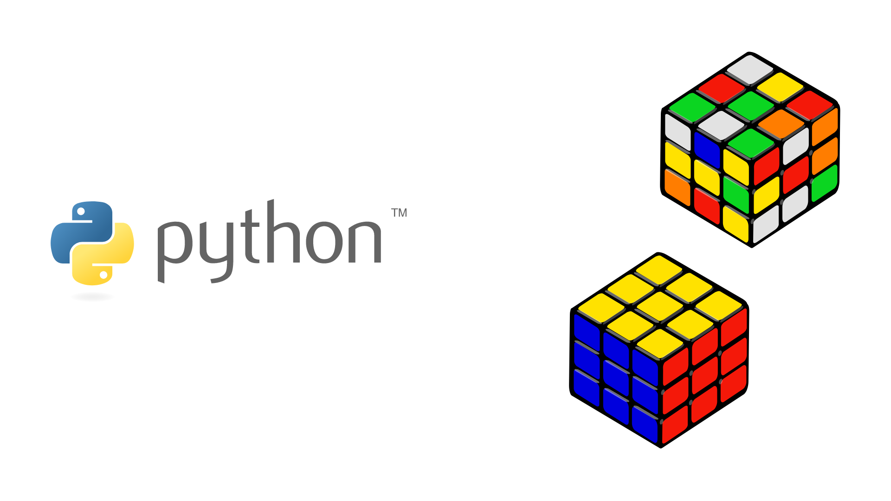
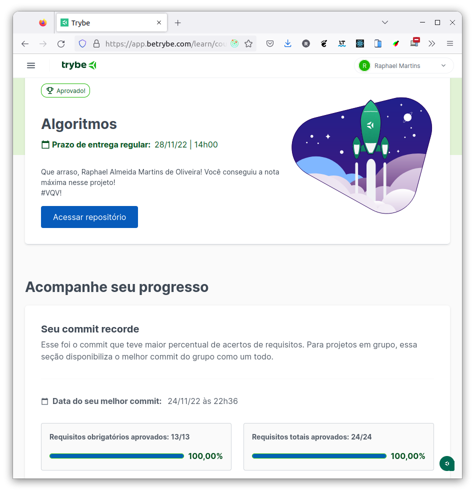

# :snake: Python Algorithms :gear:

## :page_with_curl: About/Sobre

  
<strong>:us: English</strong>
 

Python algorithms project developed by [Raphael Martins](https://www.linkedin.com/in/raphaelameidamartins/) at the end of Unit 36 ([Computer Science Module](https://github.com/raphaelalmeidamartins/trybe_exercicios/tree/main/4_Ciencia-da-Computa%C3%A7%C3%A3o)) of Trybe's Web Development course. I was approved with 100% of the mandatory and optional requirements met.

We had to solve programming logic challenges by using Python and Big O algorithms complexity concepts.
 

  
<strong>:brazil: Português</strong>
 

Projeto de Python e algoritmos desenvolvido por [Raphael Martins](https://www.linkedin.com/in/raphaelameidamartins/) ao final do Bloco 36 ([Módulo Ciência da Computação](https://github.com/raphaelalmeidamartins/trybe_exercicios/tree/main/4_Ciencia-da-Computa%C3%A7%C3%A3o)) do curso de Desenvolvimento Web da Trybe. Fui aprovado com 100% dos requisitos obrigatórios e opcionais atingidos.

Tivemos que resolver desafios de lógica de programação utilizando conceitos de complexidade de algoritmos (Big O).
 

## :man_technologist: Developed Skills/Habilidades Desenvolvidas

  
<strong>:us: English</strong>
 

* PRogramming logic
* Ability to interpret problems
* Ability to interpret legacy code
* Ability to optimize problem solving
* Solve problems/Optimize algorithms under pressure

 

  
<strong>:brazil: Português</strong>
 

* Lógica
* Capacidade de interpretação de problemas
* Capacidade de interpretação de um código legado
* Capacidade de otimizar a resolução de problemas
* Resolver problemas/Otimizar algoritmos sob pressão

 

## :hammer_and_wrench: Tools/Ferramentas

* Python
* Pytest

## :trophy: Grade/Nota

